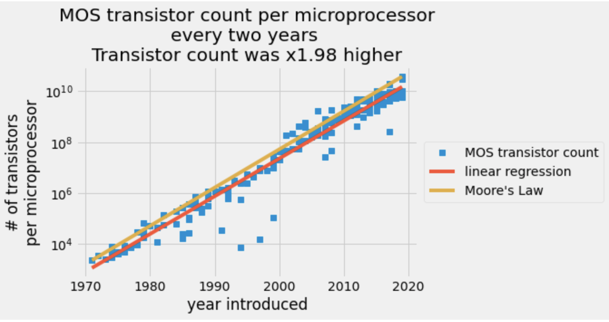

<table border=4>
<tr>
  <th> Jupytext</th>
  <th> Kernelspec</th>
</tr>
<td>
 <tr>
  <th scope="row"> data-representation </th>
  </tr>
</td>

<tr>
  <th> extension</th>
  <th> format-name</th>
  <th> format-version</th>
  <th> jupytextversion</th>
  <th>display-name</th>
</tr>
<tr>
  <th> .md </th>
  <th> myst </th>
  <th> 0.12 </th>
  <th> 1.6.0 </th>
</tr>

</table>

# Determining Moore's Law with real data in NumPy



The number of transistors reported per a given chip plotted on a log scale in the y axis with the date of introduction on the linear scale x-axis. The blue data points are from a [transistor count table](https://en.wikipedia.org/wiki/Transistor_count#Microprocessors "transistor count table"). The red line is an ordinary least squares prediction and the orange line is Moore's law.

## What you'll do

---

In 1965, engineer Gordon Moore [predicted](https://en.wikipedia.org/wiki/Moore%27s_law "predicted") that transistors on a chip would double every two years in the coming decade [[1](https://en.wikipedia.org/wiki/Moore%27s_law "1"), [2](https://newsroom.intel.com/wp-content/uploads/sites/11/2018/05/moores-law-electronics.pdf "2")]. You'll compare Moore's prediction against actual transistor counts in the 53 years following his prediction. You will determine the best-fit constants to describe the exponential growth of transistors on semiconductors compared to Moore's Law.

---

## Skills you'll learn

- Load data from a [\*.csv](https://en.wikipedia.org/wiki/Comma-separated_values "*.csv") file
- Perform linear regression and predict exponential growth using ordinary least squares
- You'll compare exponential growth constants between models
- Share your analysis in a file:
  - as NumPy zipped files `*.npz`
  - as a `*.csv` file

* Assess the amazing progress semiconductor manufacturers have made in the last five decades

## What you'll need

---

1. These packages:

- NumPy
- [Matplotlib](https://matplotlib.org "Matplotlib")
- [Statsmodels](https://www.statsmodels.org/stable/index.html "Statsmodels") ordinary linear regression

imported with the following commands

```python
import matplotlib.pyplot as plt
import numpy as np
import statsmodels.api as sm

```

2. Since this is an exponential growth law you need a little background in doing math with natural logs and exponentials.

You'll use these NumPy, Matplotlib, and statsmodels functions:

- [np.loadtxt](https://numpy.org/doc/stable/reference/generated/numpy.loadtxt.html "np.loadtxt"): this function loads text into a NumPy array

* [np.log](https://numpy.org/doc/stable/reference/generated/numpy.log.html "np.log"): this function takes the natural log of all elements in a NumPy array
* [np.exp](https://numpy.org/doc/stable/reference/generated/numpy.exp.html "np.exp"): this function takes the exponential of all elements in a NumPy array
* [lambda](https://docs.python.org/3/library/ast.html?highlight=lambda#ast.Lambda "lambda"): this is a minimal function definition for creating a function model
* [plt.semilogy](https://matplotlib.org/3.1.1/api/_as_gen/matplotlib.pyplot.semilogy.html "plt.semilogy"): this function will plot x-y data onto a figure with a linear x-axis and $\log_{10}$ y-axis plt.plot: this function will plot x-y data on linear axes
* [sm.OLS](https://www.statsmodels.org/stable/generated/statsmodels.regression.linear_model.OLS.html "sm.OLS"): find fitting parameters and standard errors using the statsmodels ordinary least squares model
* slicing arrays: view parts of the data loaded into the workspace, slice the arrays e.g. x[:10] for the first 10 values in the array, x
* boolean array indexing: to view parts of the data that match a given condition use boolean operations to index an array
* [np.block](https://numpy.org/doc/stable/reference/generated/numpy.block.html "np.block"): to combine arrays into 2D arrays
* [np.newaxis](https://numpy.org/doc/stable/reference/constants.html "np.newaxis"): to change a 1D vector to a row or column vector
* [np.savez](https://numpy.org/doc/stable/reference/generated/numpy.savez.html "np.savez") and [np.savetxt](https://numpy.org/doc/stable/reference/generated/numpy.savetxt.html "np.savetxt"): these two functions will save your arrays in zipped array format and text, respectively.

  +++

  ---

  ## Building Moore's law as an exponential functionYour empirical model assumes that the number of transistors per semiconductor follows an exponential growth,

$\log(\text{transistor-count})= f(\text{year}) = A\cdot \text{year}+B,$

where $A$ and $B$ are fitting constants. You use semiconductor manufacturers' data to find the fitting constants.

You determine these constants for Moore's law by specifying the rate for added transistors, 2, and giving an initial number of transistors for a given year.

You state Moore's law in an exponential form as follows,

$\text{transistor-count}= e^{A_M\cdot \text{year} +B_M}.$

Where $A_M$ and $B_M$ are constants that double the number of transistors every two years and start at 2250 transistors in 1971,

$\dfrac{\text{transistor-count}(\text{year} +2)}{\text{transistor-count}(\text{year})} = 2 = \dfrac{e^{B_M}e^{A_M \text{year} + 2A_M}}{e^{B_M}e^{A_M \text{year}}} = e^{2A_M} \rightarrow A_M = \frac{\log(2)}{2}$

$\log(2250) = \frac{\log(2)}{2}\cdot 1971 + B_M \rightarrow B_M = \log(2250)-\frac{\log(2)}{2}\cdot 1971$

so Moore's law stated as an exponential function is

$\log(\text{transistor-count})= A_M\cdot \text{year}+B_M,$

where

$A_M=0.3466$

$B_M=-675.4$

Since the function represents Moore's law, define it as a Python function using lambda

```
A_M = np.log(2) / 2
B_M = np.log(2250) - A_M _ 1971
Moores_law = lambda year: np.exp(B_M) _ np.exp(A_M \* year)
```

In 1971, there were 2250 transistors on the Intel 4004 chip. Use Moores_law to check the number of semiconductors Gordon Moore would expect in 1973.

```

ML_1971 = Moores_law(1971)
ML_1973 = Moores_law(1973)
print("In 1973, G. Moore expects {:.0f} transistors on Intels chips".format(ML_1973))
print("This is x{:.2f} more transistors than 1971".format(ML_1973 / ML_1971))

```

## Loading historical manufacturing data to your workspace

---

Now, make a prediction based upon the historical data for semiconductors per chip. The [Transistor Count [4]](https://en.wikipedia.org/wiki/Transistor_count#Microprocessors "transistor count") each year is in the `transistor_data.csv` file. Before loading a \*.csv file into a NumPy array, its a good idea to inspect the structure of the file first. Then, locate the columns of interest and save them to a variable. Save two columns of the file to the array, `data`.

Here, print out the first 10 rows of `transistor_data.csv`. The columns are:

| Processor                 | MOS transistor count | Date of Introduction | Designer | MOSprocess | Area   |
| ------------------------- | -------------------- | -------------------- | -------- | ---------- | ------ |
| Intel 4004 (4-bit 16-pin) | 2250                 | 1971                 | Intel    | 10,000 nm  | 12 mm² |
| ---                       | ---                  | ---                  | ---      | ---        | ---    |

```
 head transistor_data.csv
```

You don't need the columns that specify **Processor**, **Designer**, **MOSprocess**, or **Area**. That leaves the second and third columns, **MOS transistor count** and **Date of Introduction**, respectively.

Next, you load these two columns into a NumPy array using [`np.loadtxt`](https://numpy.org/doc/stable/reference/generated/numpy.loadtxt.html "np.loadtxt"). The extra options below will put the data in the desired format:

- `delimiter = ','`: specify delimeter as a comma ',' (this is the default behavior)
- `usecols = [1,2]`: import the second and third columns from the csv
- `skiprows = 1`: do not use the first row, because its a header row

```python
data = np.loadtxt("transistor_data.csv", delimiter=",", usecols=[1, 2], skiprows=1)
```

You loaded the entire history of semiconducting into a NumPy array named data. The first column is the **MOS transistor** count and the second column is the **Date of Introduction** in a four-digit year.

Next, make the data easier to read and manage by assigning the two columns to variables, `year` and `transistor_count`. Print out the first 10 values by slicing the `year` and `transistor_count` arrays with `[:10]`. Print these values out to check that you have the saved the data to the correct variables.

```
year = data[:, 1]  # grab the second column and assign
transistor_count = data[:, 0]  # grab the first column and assign

print("year:\t\t", year[:10])
print("trans. cnt:\t", transistor_count[:10])
```

You are creating a function that predicts the transistor count given a year. You have an independent variable, `year`, and a dependent variable, `transistor_count`. Transform the independent variable to log-scale,

$y_i = \log($ `transistor_count[i] `$),$

resulting in a linear equation,

$y_i = A\cdot \text{year} +B$.

```
yi = np.log(transistor_count)
```
